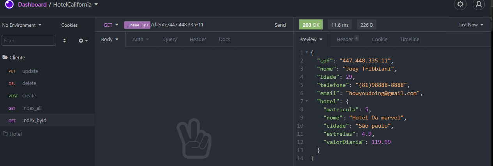
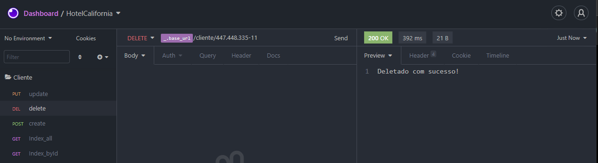

<h3><b>Hotel Califórnia</b></h3>

Projeto criado com o intuito de treinar as habilidades aprendidas no treinamento da FlexPag. 
O projeto consiste em criar um Crud de api das entidades: Hotel e Cliente.
 

Tecnologia e Framework usada(o):

- Java
- Spring boot

Ferramenta  e IDE usada:

- Eclipse
- Insomnia

Banco de dados:

O banco de dados usado foi o mysql. 
  As tabelas Criadas foram: 
  <h4>Hotel:</h4>
  Matricula(PK),Nome, ValorDiaria, Cidade  e Estrelas. 
  <h4>Cliente:</h4>
  Cpf(PK),Nome, Idade, Telefone,Email,Matricula(FK)
  

<h3>Padrão de projeto</h3>

 O projeto foi criado com o padrão de MVC. 
    Com os aquivos de:
- Model
- Controller
- Repository

<h3>Crud de Hotel</h3> 
<h5>Create de Hotel</h5>

  

<h5>Index de Hoteis</h5>

  

<h5>Index por id</h5>

  

<h5>Update de Hotel</h5>

  

<h5>Delete de Hotel</h5>

  

<h3>Crud de Cliente</h3>

<h5>Create de Cliente</h5>

  

<h5>Index de Clientes</h5>

  

<h5>Index por id</h5>

  

<h5>Update de Cliente</h5>

  

<h5>Delete de Cliente</h5>

  

